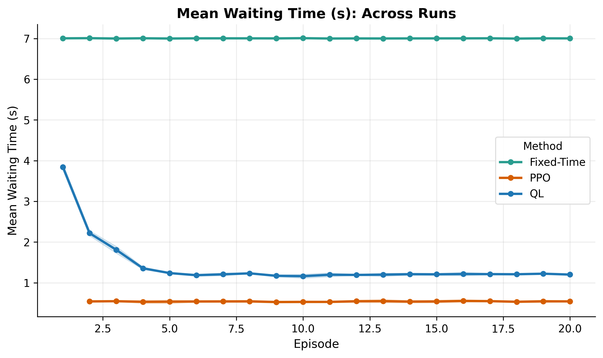
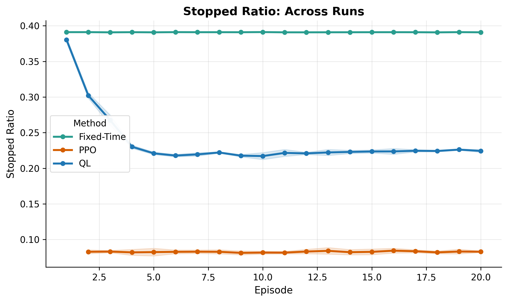
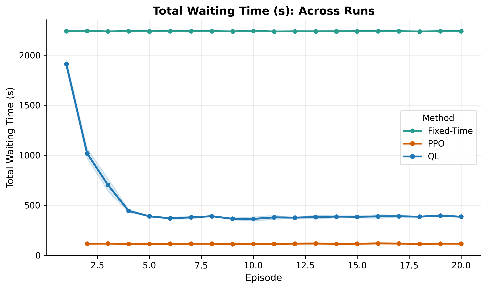
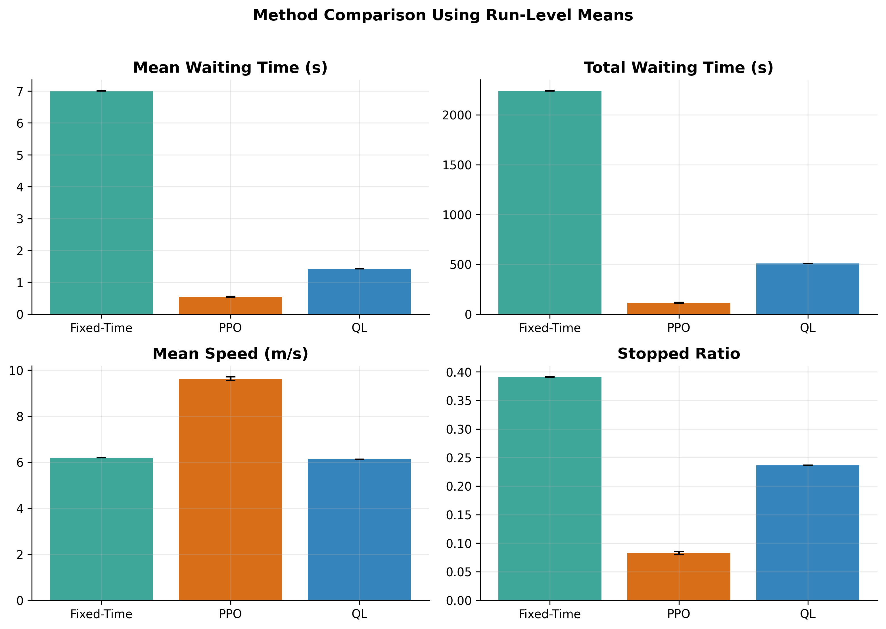
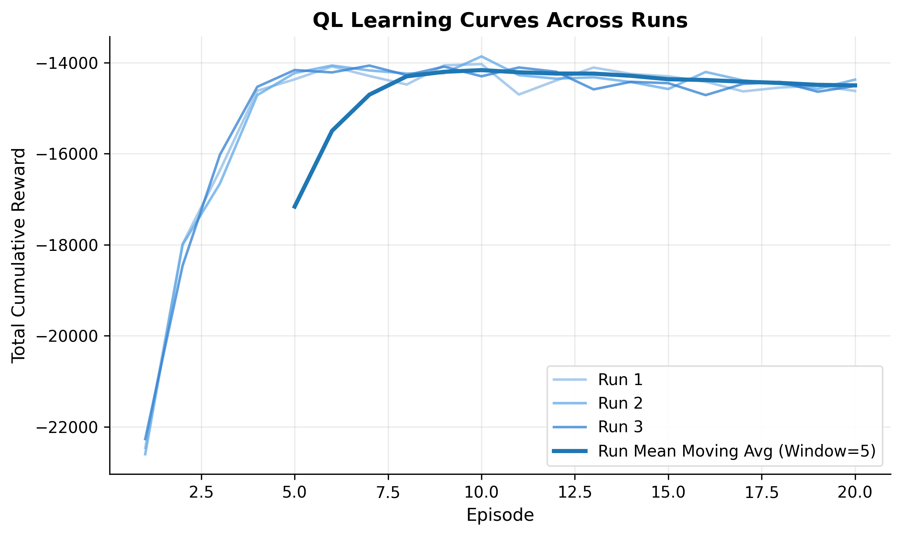
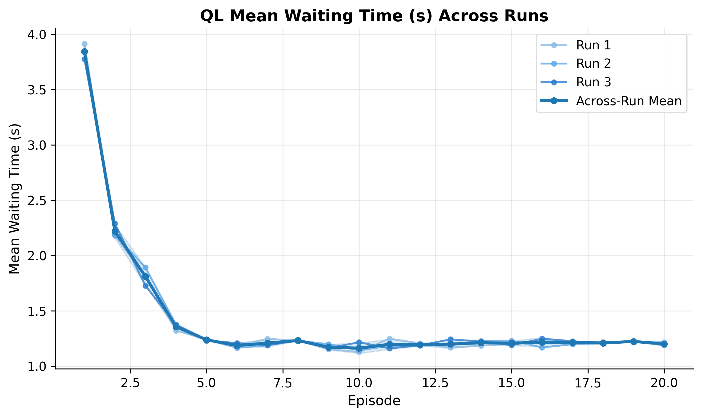
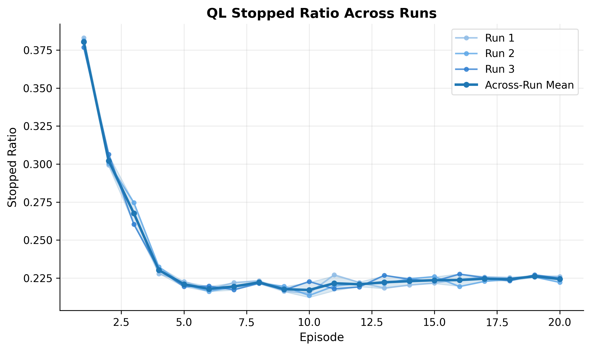
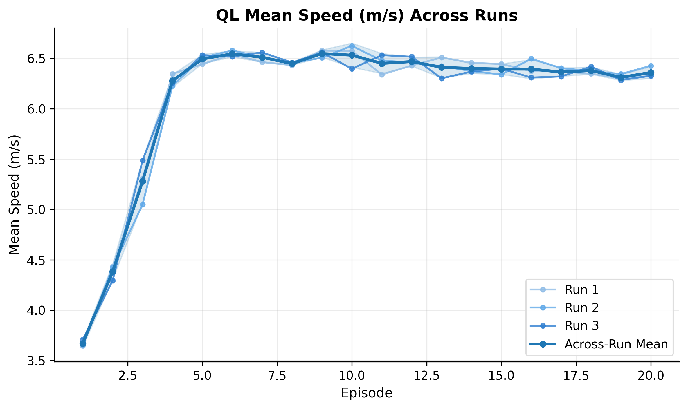

# Thesis Project: Fixed-Time vs Q-Learning vs PPO for 4x4 Traffic Signal Control

This repository is a thesis-focused experiment workspace built on top of `sumo-rl`. It compares three traffic signal control strategies on the same 4x4 SUMO network:

- Fixed-Time control
- Q-Learning
- PPO with RLlib

The current workflow is organized around reproducible runs. Each method writes run-specific CSV files, and the final thesis figures aggregate runs 1, 2, and 3.

## Result Preview

The checked-in figures below summarize the current multi-run comparison.

### Method Comparison Across Runs

<p align="center">
  
  
</p>

<p align="center">
  
  
</p>

### Q-Learning Diagnostic Figures

<p align="center">
  
  
</p>

<p align="center">
  
  
</p>

## Thesis Scope

The experiment uses one shared 4x4 traffic network and one shared environment configuration for all methods:

- Network files: `sumo_rl/nets/4x4-Lucas/`
- Shared setup: `experiments/common_4x4.py`
- Q-Learning training: `experiments/train_ql_4x4grid.py`
- PPO training: `experiments/train_ppo_4x4grid.py`
- PPO evaluation: `experiments/evaluate_ppo_4x4grid.py`
- Fixed-Time baseline: `experiments/run_fixed_time_4x4grid.py`
- Per-run comparison: `experiments/compare_ql_ppo.py`
- Per-run plots and statistics: `experiments/generate_comparison_plots_and_stats.py`
- Multi-run aggregation: `experiments/aggregate_multirun_results.py`
- Q-Learning diagnostics: `experiments/plot_ql_learning_curve.py` and `experiments/plot_ql_episode_metrics.py`

## Reward Function

Q-Learning and PPO use the same custom reward from `experiments/common_4x4.py`:

```python
reward = -1.0 * ((0.9 * stop_ratio) + (0.1 * normalized_wait))
```

Where:

- `stop_ratio` is the fraction of stopped vehicles
- `normalized_wait` is the average waiting time normalized with a 50 second cap

The reward primarily penalizes stopped vehicles, with a smaller penalty for waiting time. Better traffic performance produces less negative reward values. The fixed-time baseline uses the same network, route file, episode length, and signal timing configuration, but sets `fixed_ts=True` so SUMO follows the built-in fixed-time program.

## Repository Layout

- `experiments/`: training, evaluation, comparison, aggregation, and plotting scripts
- `outputs/`: generated CSV summaries and thesis figures
- `sumo_rl/`: local SUMO-RL environment code and the 4x4 network
- `pyproject.toml` and `setup.py`: package metadata inherited from the upstream SUMO-RL project

Important generated outputs:

- `outputs/compare_eval_summary_runs1_2_3.csv`
- `outputs/compare_eval_run_means_runs1_2_3.csv`
- `outputs/fig_mean_wait_vs_ep_runs1_2_3.png`
- `outputs/fig_stopped_ratio_vs_ep_runs1_2_3.png`
- `outputs/fig_total_wait_vs_ep_runs1_2_3.png`
- `outputs/fig_overall_metrics_runs1_2_3.png`
- `outputs/4x4/plots/ql_metrics_runs1_2_3.csv`

## Environment Setup

This project expects:

- Python 3.11
- SUMO installed
- `SUMO_HOME` set correctly
- A local virtual environment in `.venv/`

Example PowerShell session:

```powershell
cd C:\David\Thesis
$env:SUMO_HOME="C:\Program Files (x86)\Eclipse\Sumo"
```

You can run scripts through the project interpreter directly:

```powershell
.\.venv\Scripts\python.exe .\experiments\<script-name>.py
```

PPO training and evaluation require the RLlib stack used by this project, including `ray[rllib]`, `torch`, `SuperSuit`, and compatible scientific Python packages.

## Reproducible Run Order

Use `--run-id` to create separate runs. The checked-in aggregate results use runs 1, 2, and 3.

### 1. Run Q-Learning

```powershell
.\.venv\Scripts\python.exe .\experiments\train_ql_4x4grid.py --run-id 1 --episodes 20 --clean
.\.venv\Scripts\python.exe .\experiments\train_ql_4x4grid.py --run-id 2 --episodes 20 --clean
.\.venv\Scripts\python.exe .\experiments\train_ql_4x4grid.py --run-id 3 --episodes 20 --clean
```

This generates:

- `outputs/4x4/ql-4x4grid_run<id>_conn*_ep*.csv`
- `outputs/4x4/custom_metrics_run<id>_ep*.csv`

### 2. Run PPO Training

```powershell
.\.venv\Scripts\python.exe .\experiments\train_ppo_4x4grid.py --run-id 1 --episodes 20
.\.venv\Scripts\python.exe .\experiments\train_ppo_4x4grid.py --run-id 2 --episodes 20
.\.venv\Scripts\python.exe .\experiments\train_ppo_4x4grid.py --run-id 3 --episodes 20
```

This writes PPO training artifacts and checkpoints under:

- `ray_results/4x4grid_run<id>/`

### 3. Evaluate PPO

```powershell
.\.venv\Scripts\python.exe .\experiments\evaluate_ppo_4x4grid.py --run-id 1 --episodes 20 --clean
.\.venv\Scripts\python.exe .\experiments\evaluate_ppo_4x4grid.py --run-id 2 --episodes 20 --clean
.\.venv\Scripts\python.exe .\experiments\evaluate_ppo_4x4grid.py --run-id 3 --episodes 20 --clean
```

This evaluates the latest checkpoint for each run and writes:

- `outputs/4x4grid/ppo_test_final_run<id>_conn*_ep*.csv`
- `outputs/4x4grid/ppo_warmup_run<id>_conn*_ep*.csv`

For run 1, some legacy-compatible PPO files may omit `_run1` in the filename. The aggregation script handles that case.

### 4. Run Fixed-Time Baseline

```powershell
.\.venv\Scripts\python.exe .\experiments\run_fixed_time_4x4grid.py --run-id 1 --episodes 20 --clean
.\.venv\Scripts\python.exe .\experiments\run_fixed_time_4x4grid.py --run-id 2 --episodes 20 --clean
.\.venv\Scripts\python.exe .\experiments\run_fixed_time_4x4grid.py --run-id 3 --episodes 20 --clean
```

This writes:

- `outputs/4x4grid/fixedtime_run<id>_conn*_ep*.csv`

For run 1, some legacy-compatible fixed-time files may omit `_run1` in the filename. The aggregation script handles that case.

### 5. Build Per-Run Comparisons

```powershell
.\.venv\Scripts\python.exe .\experiments\compare_ql_ppo.py --run-id 1
.\.venv\Scripts\python.exe .\experiments\generate_comparison_plots_and_stats.py --run-id 1
.\.venv\Scripts\python.exe .\experiments\plot_total_wait_comparison.py --run-id 1
```

Repeat with `--run-id 2` and `--run-id 3` if per-run outputs are needed.

### 6. Build Multi-Run Thesis Figures

```powershell
.\.venv\Scripts\python.exe .\experiments\aggregate_multirun_results.py --runs 1 2 3
.\.venv\Scripts\python.exe .\experiments\plot_ql_learning_curve.py
.\.venv\Scripts\python.exe .\experiments\plot_ql_episode_metrics.py
```

This generates the aggregate CSVs and figures displayed in this README.

## Notes

- PPO evaluation writes one warmup episode before the official evaluation episodes.
- In the current PPO evaluation outputs, episode 1 can be an initialization-only CSV; comparison scripts skip incomplete episodes using row count and simulation step checks.
- `latest_matching_files()` chooses the connection id with the most episode files when multiple `conn*` groups exist.
- Multi-run plots use per-episode means across runs, with standard-deviation bands where applicable.

## Upstream Acknowledgement

This thesis repository is built on top of the `sumo-rl` project by Lucas Alegre. The upstream project provides the SUMO-based reinforcement learning environment used here.

This repository reorganizes that foundation into a smaller, thesis-specific workspace focused on one reproducible 4x4 experiment pipeline:

- fixed-time baseline execution
- Q-Learning training
- PPO training and evaluation
- per-run and multi-run comparison
- thesis-ready statistics and figure generation
