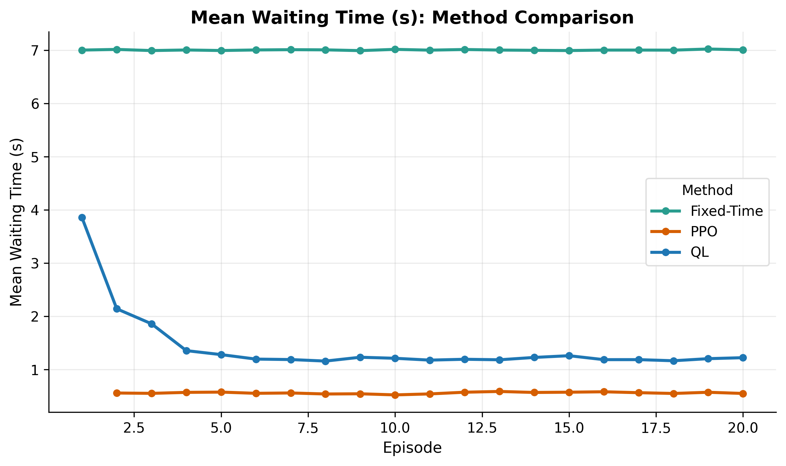
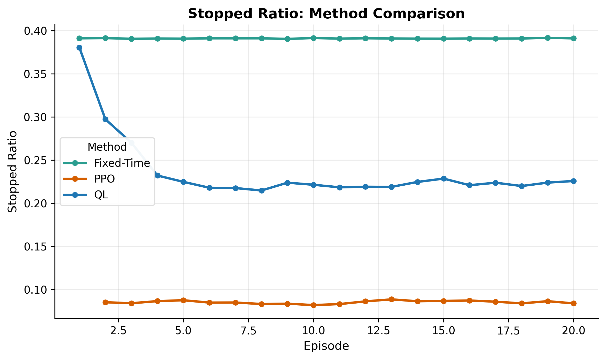
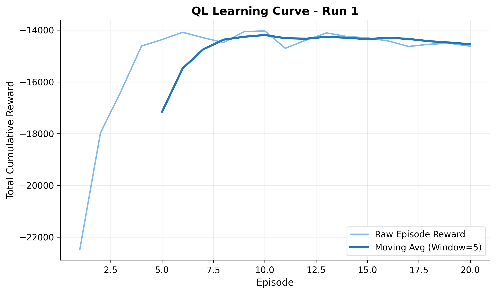
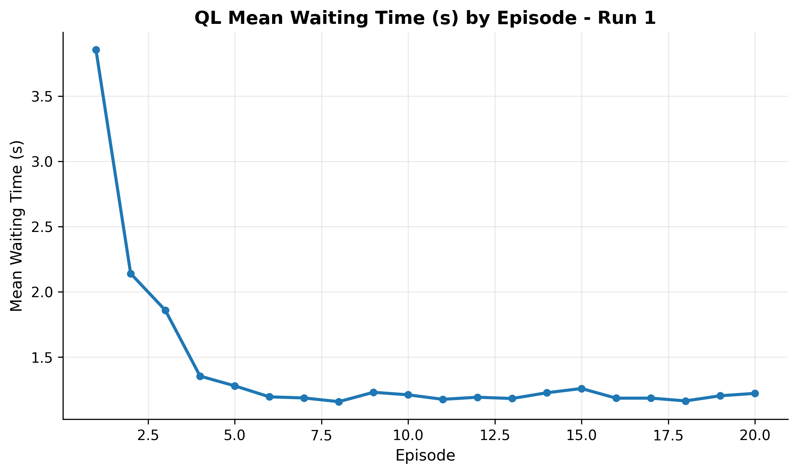
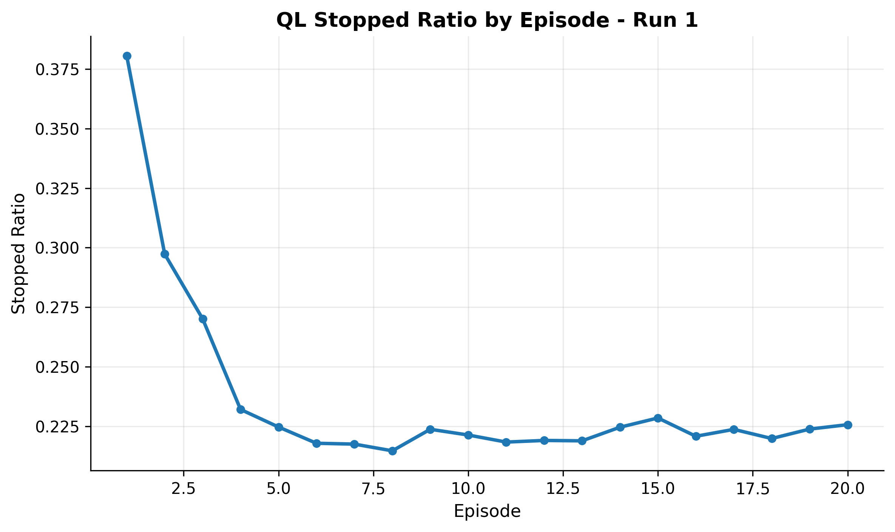
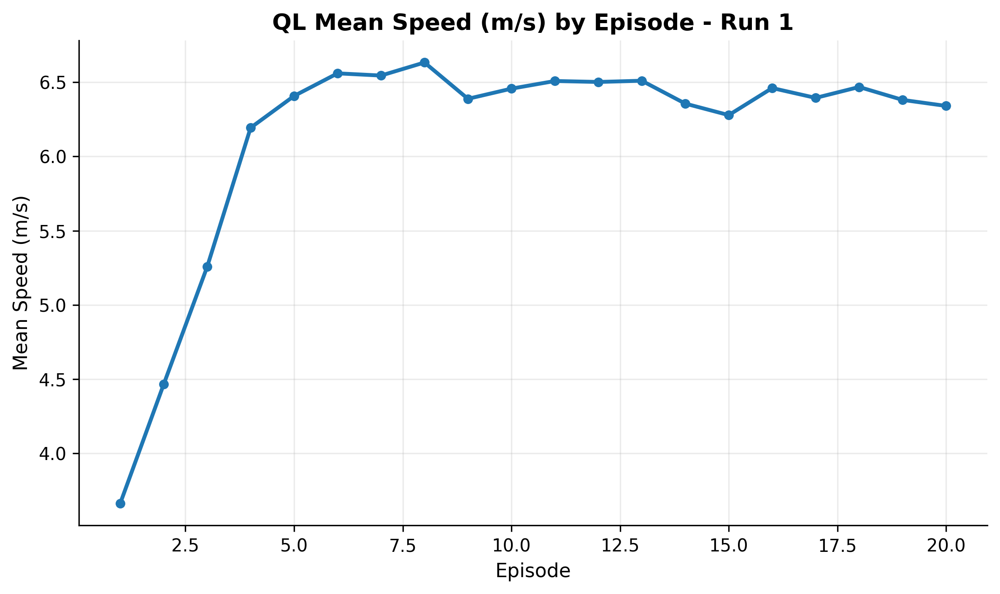

# Thesis Project: Q-Learning vs PPO for 4x4 Traffic Signal Control

This repository is a thesis-focused experiment workspace built on top of `sumo-rl`. It compares two reinforcement learning methods for adaptive traffic signal control on the same 4x4 SUMO network:

- Q-Learning
- PPO (RLlib)

The repository has been cleaned to keep only the scripts, network files, trained PPO checkpoint, generated results, and plotting utilities needed for this thesis pipeline.

## Result Preview

The main thesis figures can be viewed directly in this README.

### Main Comparison Figures

<p align="center">
  
  
</p>

### Q-Learning Diagnostic Figures

<p align="center">
  
  
</p>

<p align="center">
  
  
</p>

## Thesis Scope

The current setup uses:

- One shared 4x4 traffic network: `sumo_rl/nets/4x4-Lucas/`
- One shared reward function for both algorithms: `experiments/common_4x4.py`
- Q-Learning training script: `experiments/train_ql_4x4grid.py`
- PPO training script: `experiments/train_ppo_4x4grid.py`
- PPO evaluation script: `experiments/evaluate_ppo_4x4grid.py`
- Comparison script: `experiments/compare_ql_ppo.py`
- Plotting and statistics script: `experiments/generate_comparison_plots_and_stats.py`

## Reward Function

Both Q-Learning and PPO use the same custom reward defined in `experiments/common_4x4.py`:

```python
reward = -1.0 * ((0.9 * stop_ratio) + (0.1 * normalized_wait))
```

Where:

- `stop_ratio` is the fraction of stopped vehicles
- `normalized_wait` is the average waiting time normalized with a `50s` cap

This reward mainly penalizes congestion and, to a smaller degree, waiting time. Better traffic performance produces less negative reward values.

## Repository Layout

Main folders:

- `experiments/`: thesis experiment scripts
- `outputs/`: generated CSV summaries and figures
- `ray_results/`: PPO training artifacts and checkpoints
- `sumo_rl/`: environment code and the 4x4 network used in the thesis

Most important files:

- `experiments/train_ql_4x4grid.py`
- `experiments/train_ppo_4x4grid.py`
- `experiments/evaluate_ppo_4x4grid.py`
- `experiments/compare_ql_ppo.py`
- `experiments/generate_comparison_plots_and_stats.py`
- `experiments/plot_ql_learning_curve.py`
- `experiments/plot_ql_episode_metrics.py`

## Environment Setup

This project expects:

- Python 3.11
- SUMO installed
- `SUMO_HOME` set correctly
- The local virtual environment in `.venv/`

Example PowerShell session:

```powershell
cd C:\David\Thesis
$env:SUMO_HOME="C:\Program Files (x86)\Eclipse\Sumo"
```

You do not need to activate the environment if you call the interpreter directly:

```powershell
.\.venv\Scripts\python.exe <script>
```

## Reproducible Run Order

### 1. Run Q-Learning

```powershell
.\.venv\Scripts\python.exe .\experiments\train_ql_4x4grid.py
```

This generates:

- QL per-episode SUMO CSVs in `outputs/4x4/`
- Custom QL metric CSVs in `outputs/4x4/`

### 2. Run PPO Training

```powershell
.\.venv\Scripts\python.exe .\experiments\train_ppo_4x4grid.py
```

This generates PPO training artifacts and checkpoints in:

- `ray_results/4x4grid/PPO/`

### 3. Evaluate PPO

```powershell
.\.venv\Scripts\python.exe .\experiments\evaluate_ppo_4x4grid.py --ray_results .\ray_results --clean
```

This generates PPO evaluation CSVs in:

- `outputs/4x4grid/`

### 4. Build QL vs PPO Comparison

```powershell
.\.venv\Scripts\python.exe .\experiments\compare_ql_ppo.py
.\.venv\Scripts\python.exe .\experiments\generate_comparison_plots_and_stats.py
```

This generates:

- `outputs/compare_eval_summary.csv`
- `outputs/eval_stats_summary.csv`
- `outputs/eval_welch_tests.csv`
- `outputs/fig_mean_wait_vs_ep.png`
- `outputs/fig_stopped_ratio_vs_ep.png`

## Plotting Scripts

### QL Learning Curve

```powershell
.\.venv\Scripts\python.exe .\experiments\plot_ql_learning_curve.py
```

Output:

- `outputs/4x4/plots/learning_curve_run1.png`

### QL Metric Plots

```powershell
.\.venv\Scripts\python.exe .\experiments\plot_ql_episode_metrics.py
```

Outputs:

- `outputs/4x4/plots/ql_mean_waiting_time_run1.png`
- `outputs/4x4/plots/ql_stopped_ratio_run1.png`
- `outputs/4x4/plots/ql_mean_speed_run1.png`

## Thesis-Ready Results

The most suitable figures for the thesis main text are:

- `outputs/fig_mean_wait_vs_ep.png`
- `outputs/fig_stopped_ratio_vs_ep.png`

The most useful supporting tables are:

- `outputs/eval_stats_summary.csv`
- `outputs/eval_welch_tests.csv`

The current comparison results show PPO outperforming Q-Learning on the main traffic metrics, especially:

- lower mean waiting time
- lower total waiting time
- lower stopped ratio
- higher mean speed

## Current Notes

- PPO evaluation episode 1 contains only an initialization row and is skipped by the comparison pipeline as an incomplete episode.
- `experiments/compare_ql_ppo.py` automatically detects the available PPO `conn*` evaluation files.
- The plotting scripts use a more consistent visual style suitable for thesis figures.

## Upstream Acknowledgement

This thesis repository is built on top of the `sumo-rl` project by Lucas Alegre. The original project provides the underlying traffic signal control environment and SUMO-based reinforcement learning framework used in this work.

This repository reorganizes that base into a smaller, thesis-specific workspace focused on one reproducible 4x4 experiment pipeline, including:

- Q-Learning training
- PPO training and evaluation
- result comparison, statistics, and figure generation

The thesis-specific scripts, experiment setup, cleaned repository structure, generated results, and presentation workflow in this repository reflect the work carried out for this thesis, while the upstream project remains the technical foundation.
